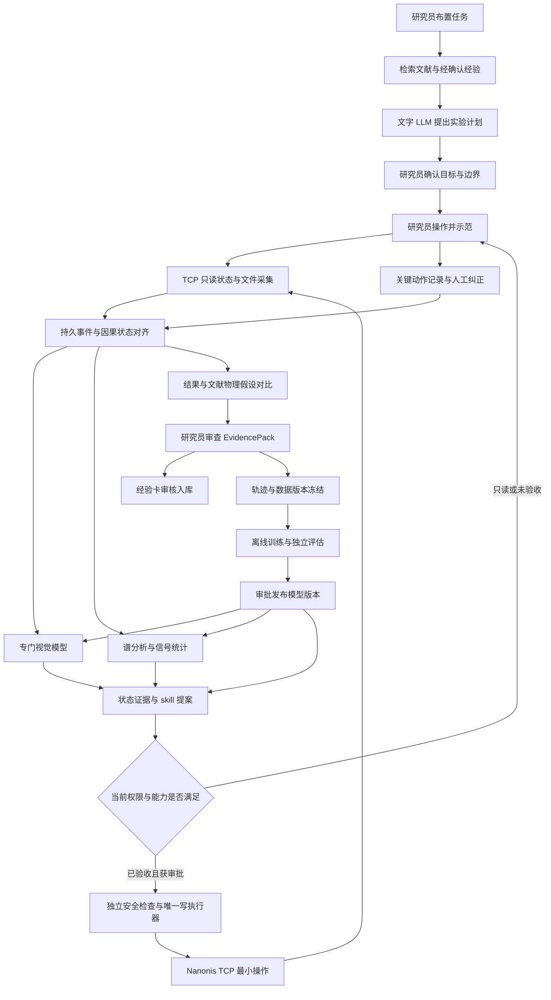

# STM/Nanonis 伴随学习模式与 TCP 最小操作单元

版本：1.0 · 整理日期：2026-09-15 · 状态：设计与历史证据汇总，尚非已部署的自主控制系统。

**范围：不讨论 RSI。研究员实际操作，系统伴随记录、分析、接受纠正，形成可检索经验和可训练轨迹；通过验证后，逐步开放有限的辅助操作。**

**重要边界：历史模拟器控制测试通过，不等于新分配 STM 的真机动作已经验收。本次仅检查文件、源码和离线替身，不连接仪器，不运行历史控制脚本。**

## 目录

- [1. 模式定义与当前状态](#s1)
- [2. 从新任务到研究员验收的完整过程](#s2)
- [3. 架构、模型与训练分工](#s3)
- [4. 示范、文字经验与训练数据](#s4)
- [5. Streaming 与执行契约](#s5)
- [6. 历史验证证据与能力分级](#s6)
- [7. Nanonis 最小操作单元映射](#s7)
- [8. 宏观 skill 如何组合 TCP 单元](#s8)
- [9. 模型训练、迁移与发布](#s9)
- [10. 接入前缺口与真机验收](#s10)
- [11. MVP 推进顺序与交付件](#s11)
- [12. 证据索引与参考文献](#s12)

<a id="s1"></a>
## 1. 模式定义与当前状态

### 1.1 伴随学习不是“录像一次后自动学会全部操作”

研究员通过 Nanonis GUI 操作，模型主要通过接口和数据文件获得观测。我们需要明确对齐五件事：**当时可见的信息、研究员意图、实际动作、动作后的结果、研究员的评价与纠正**。

一次完整示范首先用于验证采集链和形成一个可回放案例。只有覆盖不同状态、成功与失败、接管与恢复的重复示范，才可能训练出有泛化能力的策略。操作记录也不一定都是正确示范：探索、误操作、撤销必须分别标记。

“学习”分为四条不同路径：

| 路径 | 学到什么 | 怎样更新 | 一次示范能做什么 |
|---|---|---|---|
| 经验记忆 | 什么条件下要检查什么、为何这样操作 | 人工确认的 ExperienceCard 加入 RAG | 形成有来源和适用范围的经验条目，不更新 LLM 权重 |
| 感知学习 | 图是否可用、伪影、区域、谱质量 | 训练/微调专门视觉或数值模型 | 提供少量带上下文的标注样本 |
| 操作模仿 | 在已知状态下选什么 skill、配方和参数 | 使用确认过的状态-动作轨迹训练 BC/BC-RNN | 提供一段轨迹，不保证独立完成任务 |
| 参数/测点更新 | 本任务的较优参数或高信息量测点 | GP/贝叶斯优化按新测量更新后验 | 增加一个试验点，不等同于训练通用实验员 |

CALMS 的“在工作中学习”包括存储并检索研究员指导的 in-context learning，不是每次对话就微调权重。该研究也指出，文字反馈改善工具使用并不能自动弥补视觉理解不足。我们借鉴其经验记忆方式，MVP 仍采用文字 LLM 加专门图像/谱模型。[R1]

### 1.2 已有组件与待实现组件

| 组件 | 当前证据支持的状态 | 不能据此宣称 |
|---|---|---|
| 被动 logger | 已有核心信号采集、SXM 归档/解析/预览、SQLite/JSONL 记录源码 | 已完整捕获所有 GUI 动作、已经拥有可靠控制权限边界 |
| 图像标注 | 已有质量、针尖状态、伪影、建议动作、原因、审核等字段 | 已有动作执行真值、区域框/掩码、点谱与完整轨迹标签 |
| Streaming 流程彩排 | 2026-06-07 demo 中走通部分控制和文件路径，模型使用替身 | 视觉/谱模型已训练、真实物理结果已验证 |
| TCP 能力测试 | 已有 64 单元 demo 记录、684 方法静态清单、只读探测 | 684 个函数均可调用成功、均获准真机使用 |
| 可视化工作流 | 现有 `teachable_stm_workflow` 为方案展示 | 已接通训练服务器、消息系统或新仪器 |
| 伴随学习系统 | 本文定义数据桥、动作记录、轨迹构建、模型与审查接口 | 已完成 BC 训练、已部署自主研究 agent |

源码基线是 `STM_PASSIVE_LOGGER` 的 `ab6b42c`；本地还有未提交改动。本文明确区分已提交源码、本地工作区实现和未来设计，不把本次文档提交当成软件功能发布。

### 1.3 权限阶段独立于模型版本

| 阶段 | 研究员 | 系统 | 升级条件 |
|---|---|---|---|
| Observe / 伴随记录 | 完成所有操作，确认关键动作 | 只读、归档、提出低打扰的问题 | 观测/动作可追溯，时间对齐合格 |
| Shadow / 影子建议 | 仍实际操作，评价系统建议 | 生成提案但绝不写仪器 | 独立任务评估，拒判与错误处理通过 |
| Assisted / 辅助执行 | 批准单次或限定范围，随时接管 | 仅执行已验收且获授权的单元 | 命令、状态、结果与恢复路径均有证据 |
| Bounded Autonomous / 有限自主 | 审批任务边界、处理例外 | 仅在指定材料、模式、区域和动作集合内工作 | 单独真机任务验收；未知状态退出自主 |

MVP 目标是 Observe + Shadow，并为少量 Assisted 单元准备验收。更换更强模型不自动扩大权限。高风险修针、粗进针等保持独立人工门控。

<a id="s2"></a>
## 2. 从新任务到研究员验收的完整过程

### 2.1 固定主流程



箭头表示设计中的数据/控制关系，不表示这些组件已连通。经验入库与模型训练是两条支线；训练和报告不能阻塞仪器侧记录。MVP 与完全体共享此流程，只替换已定义槽位中的模型实现。

### 2.2 实验员的一次使用过程

1. **布置任务。** 说明材料、衬底、目标分子/结构、研究问题、希望得到的图/谱、参考结果、机时预算、不可操作区及已批准动作。未知字段显式保留，不由 LLM 猜填。
2. **确认计划。** 系统分别检索文献和实验员经验，列出适用条件、矛盾与缺项。计划拆为准备、参考扫描、质量判断、选区、调参、点谱、对照与总结等宏观 skill。缺少 TCP 能力的步骤标为人工步骤。
3. **开始示范。** 创建 session/episode，登记仪器、针尖、样品与版本。先验证只读连接和文件目录。GUI 的每个点击不会自动经过我们的 TCP 客户端。
4. **伴随观察。** 系统保存可读状态和已完成图/谱，运行专门模型。人工仍负责操作；界面区分“研究员实际执行”和“模型建议”。
5. **捕获关键决策。** 在改区域、改配方、做谱、修针、接管或结束时，记录动作、前后状态及一句原因。持续拖动参数可分组为一个语义决策，但原始变更序列仍保留。
6. **接受纠正。** 研究员纠正模型的图像判断、区域、动作或解释；系统保留旧预测、纠正内容和时间。研究员说“不确定”也是有效结果，不强制二选一。
7. **关联结果。** 每张图、每条谱、每次失败与重试绑定到真实执行动作。未真正采到的谱只能记为 `configured_only`、`failed` 或 `unknown`，不伪造成功数据。
8. **研究员验收。** 提交原始数据索引、参数、分析假设、误差、与文献的异同及未解决问题。与文献不同可能是新现象，不自动作为坏数据剔除。
9. **分别学习。** 经审核的解释进入经验库；图像/谱标签进入各自数据集；确认动作进入轨迹集。离线训练、独立评估和发布审批后，后续任务才使用新模型。

### 2.3 如何减少研究员负担

- 不要求每帧写长报告。常规操作自动记录；异常、接管、配方切换和阶段结束时请求短反馈。
- 快速反馈包含“观察到了什么、采取什么、为何、结果、适用范围、不确定点”。预填上下文，研究员检查后确认。
- 可附一段 session Markdown 复盘。LLM 只生成可编辑草稿，不能把自己的推测当研究员经验。
- 图片标签继续用现有标注 UI；动作/谱/纠正由独立伴随服务收集，避免打断多人多机的现有采集。
- Observe/Shadow 初期保留研究员独立示范片段，不提前展示模型建议，避免把受模型影响的操作误当独立基准。

<a id="s3"></a>
## 3. 架构、模型与训练分工

### 3.1 系统分层

| 层 | 主要组件 | 输入与输出 | 权限 |
|---|---|---|---|
| 人机协作 | 任务表单、关键动作标记、反馈、审批 | TaskSpec / OperatorAction / Feedback | 人工确认，不绕过安全检查 |
| 知识与计划 | 检索、Planner、Experience Curator、Reporter | EvidenceBundle / ExperimentPlan / 经验草稿 / 报告 | 只读数据，只能提案 |
| 感知 | ImageQC、ROI、SpectrumQC、Health、TipState | 原始数组与状态 → 有版本的分析结果 | 无仪器写权限 |
| 决策 | skill 选择、配方选择、BO/GP、后续 BC | 结构化证据 → ActionProposal | 无仪器写权限 |
| 安全执行 | CapabilityRegistry、审批、状态机、单写者 | ApprovedCommand → OperationUnitRun | 仪器侧唯一程序写入口 |
| 数据学习 | Bridge、事件库、TrajectoryBuilder、训练、ModelRegistry | 不可变样本与轨迹 → 经评估候选版本 | 不持有仪器控制凭证 |

多 agent 是职责和上下文隔离，不必等于多台服务器或多套 LLM 权重。不得向 LLM 暴露完整 `nanonis_spm.Nanonis` 实例、任意函数名分发或自由 Python 执行能力。

### 3.2 模型清单与输入输出

沿用既有 Qwen3 基线，不作“当前最强模型”排名。所有公开权重都是候选起点，使用前记录许可证、revision、hash，并完成本地任务评价。

| 槽位 | MVP | 后续同接口替换 | 输入 → 输出 | 再训练要求 |
|---|---|---|---|---|
| 文字 LLM | Qwen3-14B，资源不足时评估 Qwen3-8B | 经同一任务集评测的文字模型 | 任务、结构化图/谱结果、工具 schema、证据 → 计划/解释/报告草稿 | MVP 不训练；RAG 更新不是微调 [R4] |
| Embedding | BAAI/bge-m3 | 通过检索基准的同类模型 | 文本 → 检索向量 | 初期不训练；更换版本重建索引 [R5] |
| Reranker | bge-reranker-v2-m3 | 同槽位模型 | 查询与候选文本 → 相关性排序 | 初期不训练；相关性不是真实性 [R6] |
| ImageQC | 数值规则 + MobileNetV3-Small 质量/伪影头 | 共享骨干、多任务头、分域校准 | SXM 数组、mask、尺度、通道、条件 → 质量/伪影/不确定性 | 任务头需训练，通用 ImageNet 权重不是 STM 权重 [R7] |
| ROI | 人工选区、规则；YOLO11n 仅作待训候选 | 经验证的检测/分割头 | 图像、坐标变换 → bbox/mask/候选测点 | 框或掩码标注后微调；整图标签不能替代定位标签 [R8] |
| SpectrumQC | 数值 QC、重复性、物理拟合 | LightGBM 或小型 1D-CNN | 偏压轴、I/dI-dV、锁相配置、重复谱 → 质量、物理量与误差 | MVP 校准规则；学习模型需要本地谱标签 [R9] |
| Health | EWMA/Kalman、确定性异常规则 | 经本地验证的异常模型 | 电流/Z/反馈与时间、图像配准位移 → 异常/漂移证据 | 噪声和阈值校准；横向漂移不能只靠电流/Z 判断 |
| TipState | 图像/谱/参数证据与专家规则 | 校准的多头模型或 LightGBM | 修针前后配对数据及参考区 → 必要性/效果/拒判 | 配对数据与本地训练；坏图不直接等于坏针 |
| 参数优化 | 专家配方；受限 BoTorch/GPyTorch 试点 | 分域 GP、多目标 BO、必要时 DKL | 参数、质量分项、耗时、约束 → 参数提案 | 按任务拟合 GP，不需要大模型预训练 [R10] |
| 测点选择 | 人工或固定网格 | GP/DKL 主动学习 | 已测位置与谱、候选 ROI → 下一候选测点 | 按任务拟合，必须先补齐定位/做谱能力 |
| 示范策略 | 规则/skill 基线，采集轨迹 | BC-RNN：特征 + 数值状态 + GRU/LSTM | 决策时可见历史 → skill/配方/参数/拒判 | 需确认动作轨迹训练；robomimic 无本机 STM checkpoint [R2][R3] |
| RL | 关闭 | 另行立项的局部策略 | 本文仅预留同一提案接口 | 不是伴随学习 MVP 的前提 |
| 安全与运行时 | 确定性规则、状态机；LangGraph 可编排 | 流程固定 | 审批、状态与提案 → 允许/拒绝/运行结果 | 非模型，不训练；不可由学习模型取代 [R11] |

LLM 的 Planner、经验整理、语义复核、Reporter 四种角色可以共享同一服务，但分别存储上下文和权限。LLM 不接收整幅图像或原始谱来承担 MVP 感知任务；它读专门模型产生的结构化摘要和证据引用。

### 3.3 “经验”如何与感知模型结合

采用“感知给证据，经验给条件化操作逻辑”的组合，而不是把所有经验压成有限图像标签：

```text
原始图/谱 + 仪器状态
  → 专门模型输出：可用性、伪影、区域、拟合量、不确定性
  → StateAssembler 形成带缺失/时效标记的证据状态
  → RAG 按材料、衬底、模式、证据检索经验
  → skill 匹配前置条件和退出条件
  → 形成带证据的提案；缺关键证据时 ask_human
```

例如，“先排查扫描区域，再考虑针尖问题”可以是经验卡和 skill 分支；“是否有重影”可以是视觉模型的输出。经验卡不能把低置信度的重影检测变成确定事实。文献先验、本机经验和当前观测互相冲突时并列展示，交由研究员确认。

<a id="s4"></a>
## 4. 示范、文字经验与训练数据

### 4.1 现有 logger 数据能怎样使用

基于本地 `dataset_writer.py` 和 `label_schema.yaml` 检查，已有 `sessions`、`scans`、`signals`、`events`、`labels`。图像标签包括 `image_quality`、`artifact_tags`、`tip_state`、`surface_quality`、`next_action`、`confidence`、`reason_text`、`annotator_notes` 和审核字段；还记录材料相关字段与部分视图设置。

| 当前字段/数据 | 可用于 | 需要注意或补充 |
|---|---|---|
| SXM 原始数组与元数据 | ImageQC、表面与目标特征、预处理比较 | 保存单位、通道、forward/backward、mask；PNG 不能替代原始科学数据 |
| `image_quality` | 有序质量分类、可用性判别 | 明确“可用于找区域”还是“可用于定量/做谱”；审核和域信息必须保留 |
| `artifact_tags` | 多标签伪影任务 | 未选中的标签未必已经检查；新增标签覆盖状态，不能一律当负例 |
| `tip_state` | 针尖表观状态的监督起点 | 作为有来源的专家判断；缺参考区/谱时不是确定的针尖物理真值 |
| `next_action` | 建议动作排序、偏好或审查数据 | 这是事后建议，不是实际执行动作，也没有充分的实际参数标签 |
| `reason_text`、备注 | 经验卡草稿、检索、解释评价 | 需提取适用条件、原始引用和审核状态；不能作为动作前已知事实 |
| 信号快照 | 低频运行上下文、事件关联 | 当前快照不是同时采样；需逐字段时间与质量信息 |
| 图像标注视图设置 | 复现研究员如何看图 | 不等同于 Nanonis GUI 操作历史；标注预处理要版本化 |

当前 `labels` 对同一 `(scan_id, annotator)` 更新会覆盖旧标签，仅保存更新时间，不能代替完整纠正历史。伴随服务应新增 append-only `label_revision`/`Feedback`，中央训练导出保留版本，现有标注工具不必立即重构。

### 4.2 GUI 操作与 TCP 观测之间的缺口

**TCP 查询当前值不是 GUI 事件订阅。** 短脉冲、临时改值后恢复、点击但未生效、连续拖动、同值重设，都可能无法从轮询还原。最终完整 SXM 也不代表研究员决策当时已经看到全图。

| 捕获方式 | 实际能证明什么 | 建议标签 |
|---|---|---|
| 将来经审查的带记录动作入口 | 请求、参数、协议回复；再结合读回/文件才能确认效果 | `api_logged`，执行结果另记 |
| GUI 操作后研究员确认关键事件 | 人工确认的动作与参数，可能只有时间区间 | `human_confirmed`，保留时间误差 |
| 两次 getter 值发生改变 | 观测到状态差异，不一定知道原因或执行者 | `inferred` |
| 无法观察到动作 | 只能确认信息缺失 | `missing` |

`api_logged`/`human_confirmed` 可以属于 confirmed 来源，但仍不等于 `completed`。系统必须分别记录来源可靠性、执行状态和科学结果，不能混成一个 `ok`。

推荐优先覆盖关键语义决策。GUI 截图或操作录屏可作为经同意的人工复核附件，不是 MVP 的多模态模型输入。若无法获得决策时可见的部分帧，只训练“完成一帧后的选择”，不声称学会实时中止扫描。

### 4.3 统一数据对象

以下为新增设计，不是当前数据库已经具备的字段。

| 对象 | 必需内容 |
|---|---|
| TaskSpec | task_id、问题、成功标准、域、预算、禁入区、审批范围 |
| DomainKey | site_id、instrument_id、材料/衬底/分子、温度/环境、模式、sample_id、tip_id、校准版本 |
| Observation | 原始引用/hash、单位、shape、通道、event_time、available_at、source_seq、缺失与有效 mask |
| DecisionRecord | 决策时刻、当时可见观测引用、研究员意图、模型提案、最终人工选择、理由产生时刻 |
| OperatorAction | 来源、unit_id/skill_id、请求参数、确认参数、发起/结束时间、执行者、确认者、执行状态 |
| Intervention | 接管原因、被否决提案、接管时状态、恢复动作、恢复后结果、退出自主时刻 |
| ExperienceCard | 来源类型、原文/页码或事件、适用条件、观察证据、操作原则、禁忌、例外、审核与版本 |
| TrajectoryStep | obs_before、proposed_action、executed_action、obs_after、duration、outcome、label_mask、terminated/truncated |
| TuningTrial | 参数范围版本、请求/实际参数、质量分项、代价、约束、测量不确定度、失败/删失原因 |
| DatasetVersion | 样本清单/hash、schema、标签/预处理版本、划分、许可证、审核状态、排除原因 |
| EvidencePack | 任务/计划、动作审计、图谱原件、分析、文献对照、模型与数据版本、未解决项、研究员结论 |

### 4.4 因果时间对齐

- 同时保留事件发生时间 `event_time`、可供系统使用时间 `available_at`、入库时间 `ingested_at`；单机增加单调时钟与序号，多机增加时钟偏差/不确定度。
- 决策输入只允许使用 `available_at <= decision_time` 的信息。事后整图、后续谱、人工复盘是监督信号，不回填为决策输入。
- 人工知道而接口不知道的状态，例如 CCD 所见、听到异常、局部未保存图，记为 `privileged_context`。无法补齐时，相关样本不用于训练可自主执行的动作策略。
- 不把多个串行 getter 的时间戳当硬件同步采样；记录每个 getter 的起止时间和数据质量，融合时有时效窗口。
- 未观察到的动作不靠 LLM 补全。可以生成待确认假设，但不能进入 confirmed 动作标签。
- `wait`、`stop`、`ask_human`、接管和失败也必须记录；等待不是固定采样率下无数个重复的同一动作。

### 4.5 文字经验最小模板

```yaml
experience_id: exp-example
source_type: operator
source_refs: [decision-example, scan-example]
domain_ref: domain-example
observed: "参考区图像出现疑似重影，尚未确认针尖原因。"
reasoning: "先排查区域与采集条件，再决定是否需要针尖检查。"
suggested_skill: tip_check
preconditions: [reference_region_available, observation_valid]
exceptions: [missing_reference, unsupported_material]
outcome: uncertain
review_status: draft
reviewed_by: null
version: 1
```

这只是结构示例，不是某次真实实验结论。文献型经验使用 `source_type: literature`，补 DOI、页码、原研究材料和实验条件；禁止把参考文献中的示例参数直接转成当前仪器安全限值。

### 4.6 多人多机汇总

采用持续增量采集，不等待“一次性全部收齐”。中央训练端周期性冻结 DatasetVersion；正在进行的实验继续写自己的本地库。

1. 各机导出一致性快照和原始文件 manifest；SQLite 使用在线备份 API 或在停止写入后导出，不能直接拷贝正在使用的主文件而忽略 WAL。
2. 以命名空间化 ID 和原始文件 hash 处理重复；保留多个标注者的分歧，不按最后修改覆盖。现有 `sxm_sha1` 可作兼容索引，新清单增加 SHA-256，不静默重命名旧 ID。
3. 中央库存储图像、谱、轨迹、经验和模型各自的 schema/版本；公开数据和本地数据区分来源、许可与训练用途。
4. 训练数据版本冻结后不可修改；新的审核、修正形成下一版本。模型发布与任何仪器的操作授权分开。

<a id="s5"></a>
## 5. Streaming 与执行契约

### 5.1 四种流不能混用

| 数据流 | 路径 | 可靠性要求 |
|---|---|---|
| 观测流 | PI/文件 → 持久事件 → StateAssembler → 专门模型 | 原件先归档；丢失、重复、乱序和陈旧均可识别 |
| 动作流 | 完整提案 → 审批/安全 → 唯一写执行器 → 回执/读回/结果 | 有限状态机；重复消息不等于重复硬件执行 |
| LLM 文本流 | token → UI；最终对象 → schema 校验 | 半截 JSON、说明文字和思考内容不能触发动作 |
| 学习流 | 审核 → 数据冻结 → 训练 → 独立评估 → 发布 | 与在线采集解耦，不在运行中的实验热换模型 |

MVP 建议使用仪器侧 Python 服务、SQLite WAL 事件/outbox、受限队列和独立 worker。UI 状态可用 SSE，提交反馈和审批用完整 HTTP 请求。大数组留在不可变文件库，队列传引用。未来更换消息中间件不改变业务事件和模型契约。

### 5.2 事件与生产/消费关系

| 事件 | 生产者 | 消费者 | 触发与必需载荷 |
|---|---|---|---|
| TelemetrySample / HealthEvent | 只读采集 | 状态融合、健康检查、归档 | 实际采样时；值/单位/各字段时间/错误 |
| ScanFrame | SXM watcher 或已验收 bulk 读取 | ImageQC、ROI、TipState | 原始文件稳定且解析成功；hash、shape、尺度、通道、方向 |
| PartialScanFrame | 另行验证的部分帧适配器 | 部分帧模型、回放 | 有效区域与真实可用时间都可信时；否则不发此事件 |
| Spectrum | 谱文件/接口适配器 | SpectrumQC、物理拟合、选点 | 真实采集完成；偏压/时间轴、通道、单位、位置、锁相配置 |
| OperatorAction / Intervention / Feedback | 动作入口与研究员 | 轨迹构建、经验草稿、审核 | 意图、来源、实际动作、前后观测、确认与纠正时间 |
| AnalysisResult / AnalysisBundle | 专门模型 worker | skill、规划、报告 | 输入事件 ID、模型/预处理版本、结果、不确定性、时效 |
| ActionProposal / ApprovedCommand | 提案者、安全与审批 | 唯一执行器 | unit、参数/单位、状态版本、有效期、域、审批绑定 |
| OperationUnitRun | 执行器 | 审计、状态融合、轨迹 | 发起、回复、读回、完成/失败/未知，原始响应引用 |
| TextDelta / PlanValidated | 文字 LLM 与校验器 | UI、计划状态机 | token 仅展示；完整计划通过 schema 与权限检查 |
| DatasetFrozen / ModelCandidate / ModelApproved | 数据、训练、研究员 | 注册表、推理服务 | manifest、模型 hash、评价、域、批准者及版本 |

### 5.3 采样与并发

历史只读测试记录 `Util_AcqPeriodGet` 约 20 ms，五项 getter 一轮中位耗时约 0.920 ms。这只能描述当时配置的采集周期和 TCP 调用开销，不能把约 1087 轮/秒的倒数估算当成真实新样本率，也不能推导新仪器所有信号都是 50 Hz。[L2][L3]

初期可从既有 1 Hz 配置开始，按任务验证是否需要更快；10-50 Hz 只是历史报告提出的测试范围，不是已经验收的长期速率。高频保护保留在仪器实时系统和独立保护通道，不能依赖 Python 轮询或云端 LLM。[R12]

同一个 TCP socket 必须串行请求/响应。多 worker 不能竞争读取同一连接。默认持久连接、受控退避；耗时 bulk read 和等待命令不能饿死状态监测。是否支持独立监测连接/端口要在本机核实，不假定多个客户端一定可用。

伴随服务不应为每个模型新建 TCP 连接；优先订阅 logger 导出的观测。当前并无已验证的实时订阅桥，需单独实现。只有一个逻辑控制 owner：人工 GUI 与自动执行不能同时自由写入；接管时先撤销自动授权、清理未发送提案并核对正在执行的动作。

### 5.4 最小操作契约

一个 TCP 方法调用是协议级原子单元，不一定是物理原子动作。一个完整 skill 则由多个单元和判断组成。统一定义：

```json
{
  "unit_id": "scan.frame.set",
  "api_method": "Scan_FrameSet",
  "wire_command": "Scan.FrameSet",
  "capability_key": "instrument+software+wrapper+unit+tested_conditions",
  "parameter_schema_ref": "schemas/scan-frame-v1",
  "preconditions": ["current_state_valid", "approved_region", "control_owner_confirmed"],
  "postconditions": ["frame_readback_matches"],
  "evidence_refs": ["L1:SCN-001", "L1:SCN-001R"],
  "historical_evidence": "demo_pass",
  "target_instrument_verified": false,
  "authorization": "deny_until_accepted",
  "timeout_policy": "bounded_and_recorded",
  "retry_policy": "reconcile_before_retry",
  "physical_reversibility": "not_assumed"
}
```

该示例是注册表设计，不是可执行配置。真实注册项必须补齐数值类型、单位、枚举、批准范围、最大变化率、前后状态、timeout、回复解码、后置验证、失效和接管规则。`Bias_Set` 对应 `Bias.Set`，但不能靠字符串替换猜所有 wire command；以该版本 wrapper 和协议文档逐项核对。

`ActionProposal` 必须包含 `command_id`、`based_on_state`、`unit_id`、`params`、`units`、`domain_ref`、`expires_at` 和证据。审批绑定完整参数及范围；参数、域或状态实质变化后原审批失效。LLM 不能填写批准者或伪造审批状态。

### 5.5 执行状态与失败处理

```text
proposed → approved → dispatching → accepted → running
                                           → completed / failed / unknown
```

- `accepted` 仅表示无协议错误的接受；`completed` 要有动作对应的后置证据。科学成功另用 outcome，不能以函数返回作为实验成功。
- 消费者按 event_id 去重、可回放；发送命令前持久化意图。消息的 at-least-once 不提供硬件 exactly-once。
- 发送后断线或超时意味着动作可能已发生：标 `unknown`、停止后续依赖动作、查状态或人工核对；不能自动重发脉冲、运动或修针。
- 某些设值理论上可重复，但仍要重新检查当前状态、审批与物理影响；不能仅因为是 Set 就宣称幂等。
- 等待 worker 超时、杀线程、关闭 socket 不能证明仪器动作已停止；尤其 `BiasSpectr_Start` 曾阻塞，必须有独立核验过的停止/监测路径，无法建立时保持人工操作。
- 扫描 stopped 可能是完成、人工中止或错误。用操作状态、文件、有效区域、时间和异常联合确定结果。
- 停止自动流程不等于一律退针或关闭反馈。处置序列必须由本机负责人依据状态验收；硬件保护不依赖 UI、LLM 或训练服务。

### 5.6 模型可插拔契约

`ModelRequest`：request_id、slot_id、schema_version、input_event_ids、raw_refs、DomainKey、StateSnapshot、deadline。

`ModelResult`：同一 request_id、model/version/hash、preprocess_version、dataset_version、输入引用、prediction、uncertainty、abstain、produced_at、evidence_refs。

所有槽位提供 `describe / input_schema / output_schema / predict / health`；支持训练的插件另有 `fit / evaluate / export`。每个槽位的 prediction 有专门 schema，不是任意 JSON 都能互换。缺输入、错误单位、过期结果、域外或超时应返回缺失/拒判，不能默默给默认正常值。

<a id="s6"></a>
## 6. 历史验证证据与能力分级

### 6.1 证据分级

| 级别 | 含义 | 可支持的结论 |
|---|---|---|
| I：inventory_only | wrapper/协议中存在方法 | 可以开展适配设计，不能证明运行可用 |
| D：demo_pass | 模拟/demo 条件下调用或流程通过 | 支持该条件的软件联调；不证明真实样品/针尖安全 |
| R：read_observed | 只读测试有返回记录和可解释数据 | 支持历史只读能力；仍需目标机重验与错误检查 |
| E：error_or_partial | 模块错误、解码失败、空结果或阻塞 | 对应能力未验收；降级、修复或人工完成 |
| B：blocked_or_skipped | 未执行、默认阻止、软件占位 | 不能记作测试通过 |
| H：hardware_accepted | 指定真机、任务、条件下完成书面验收 | 仅在验收范围和现行授权内可用 |

级别不替代权限。本文没有足够证据把新分配仪器上的写操作标为 H。新增验收必须记录设备身份、软件/模块/协议版本、材料与模式、参数域、执行前后结果及签署人；端口连通不是设备身份认证。

### 6.2 已检查的历史结果

- **L1：2026-06-07 最小操作测试。** 共 64 个单元条目：`ok=48`、`nanonis_error=4`、`blocked_high_risk_by_default=6`、`skipped=6`。其中含软件占位、组合连接、同函数不同动作，不是 64 个不同 API。测试属于 demo 背景，不能升级为新真机验收。
- **L4：同日全流程彩排。** 55 个事件，图像和谱判读使用 `HumanSubstitute*`；Bias spectroscopy 最终为 `configured_only`，`BiasSpectr_Start(Get_data=1)` 曾阻塞。模拟图基本为平面，不能作为真实 ImageQC/修针效果证据。
- **L2/L3：2026-06-11 本机 PI 只读测试。** 21 个 getter 调用中，脚本记 19 个 `ok=true`、2 个异常；部分 `ok=true` 仍有模块错误/空结果，不能把 19 个全算作有效数据。记录了 Generic 5e 等软件信息，不构成物理 STM 在位和健康状态证明。
- **L5：684 方法静态枚举。** read/query 274、read/bulk 13、control/write 355、unknown 25、internal/helper 17。分类是保守字符串规则，不是逐条验证结果；例如等待/保存等需要按语义重新分类。
- **L8：2026-07-11 logger demo 记录。** 找到 session、信号和 SXM 归档事件，版本查询存在超时记录；说明日志路径有运行痕迹，不新增任何真机控制单元验收。

历史某次目录或 CLI 使用 `real`/`live` 表示实际连接 Nanonis 软件，与 `dry-run` 相对；不能单凭这个名字认定连接了真实样品和 STM。

<a id="s7"></a>
## 7. Nanonis 最小操作单元映射

### 7.1 只读观测与元数据

下表列出 L2 的全部 21 项，并保留模块错误和 wrapper 问题。R 表示历史读到数据，不表示当前 logger 已接入所有这些字段。

| 方法 | 观测/用途 | 历史级别与接入限制 |
|---|---|---|
| `Bias_Get` | 偏压；关联图谱与调参 | R，仍需检查仪器错误和单位 |
| `Current_Get` | 实测电流；稳定性上下文 | R，不是电流设定值 |
| `ZCtrl_OnOffGet` | 反馈状态 | R，关反馈不等于任意安全状态 |
| `ZCtrl_ZPosGet` | Z 位置；运行上下文 | R，不单独代表针样距离 |
| `ZCtrl_SetpntGet` | 反馈设定点 | R，单位取决于反馈信号/模式，不能无条件写成 A |
| `ZCtrl_GainGet` | P、时间常数、I 等参数 | R，字段/单位以本机协议与反馈信号为准 |
| `Scan_StatusGet` | 扫描状态 | R，stopped 不等于成功完成 |
| `Scan_BufferGet` | 记录通道、pixels/lines | R，通道索引与名称需绑定版本 |
| `Scan_FrameGet` | 中心、尺寸、角度 | R，扫描 frame 不是当前针尖 XY 位置 |
| `Scan_PropsGet` | 扫描属性 | E，历史 wrapper `int + list` 解码错误 |
| `Scan_SpeedGet` | 正反扫速度/行时间及约束模式 | R，保存全部字段，不简化成一个速度 |
| `Signals_NamesGet` | 信号名称字典 | R，历史返回 128 个；不代表新机固定相同 |
| `Util_SessionPathGet` | 保存目录 | R，目录改变需审计和重新绑定 |
| `Util_AcqPeriodGet` | 采集周期 | R，不能保证每个模块的实际更新率 |
| `Util_RTFreqGet` | RT 频率 | R，不等于外部 Python 可达闭环速率 |
| `Util_RTOversamplGet` | RT oversampling 配置 | R，采样/平均语义需核对 |
| `DataLog_StatusGet` | 内置记录器状态 | R，仅测试查询，未验收 Start/Stop |
| `TCPLog_StatusGet` | TCP logger 状态 | E/部分，报告记录内部 VI 错误，不能采信仅解析出的 0 |
| `BiasSpectr_StatusGet` | 偏压谱模块状态 | E/部分，parsed list 为空；不能视为谱已完成 |
| `ZSpectr_StatusGet` | Z 谱模块状态 | E/部分，模块不可访问错误；0 不是有效测量状态 |
| `Util_VersionGet` | 软件/控制器版本 | E，wrapper 解码失败；另有 raw `Util.VersionGet` 成功历史证据 |

raw fallback 只针对经测试的命令和 decoder，不允许遇到错误后把任意 raw command 自动放行。版本探测另开连接可能失败，不能假定与主连接并行可用。

### 7.2 历史 64 条最小单元逐项对照

下表保持 L1 原始 unit_id 与 status，不修改原测试结果。`D` 仅说明 demo 下软件调用结果；同值写回、反馈置 Off、电机幅度置零等仅验证该特定调用，不覆盖全部参数范围和实际动态效果。原 CSV 中风险标记不是当前真机的最终分级。

| 历史 unit_id | TCP 方法或软件项 | L1 原始状态 | 伴随学习中的作用与限制 |
|---|---|---|---|
| SYS-001 | `socket + Bias_Get + Current_Get + Util_SessionPathGet` | ok | D；连接与核心读探测，组合项，后续应拆为单元 |
| SYS-002 | 快照组合 | skipped | B；由独立 getter 组成，不是一个 API |
| SYS-003 | run 上下文记录 | skipped | B；软件记录 task/run/配置，不是 TCP |
| SYS-005 | demo 限值校验 | skipped | B；不能替代真机 SafetyPolicy |
| APP-001 | `Bias_Set` | ok | D；偏压设定提案，需授权、读回和稳定性检查 |
| APP-001R | `Bias_Get` | ok | D；偏压读回，另有 L2 记录 |
| APP-002 | `ZCtrl_SetpntSet` | ok | D；反馈设定点写入，需模式和单位验证 |
| APP-002R | `ZCtrl_SetpntGet` | ok | D；设定点读回 |
| APP-003R | `ZCtrl_GainGet` | ok | D；记录反馈配方 |
| APP-003 | `ZCtrl_GainSet` | ok | D；仅特定值写入，不等于动态 PID 优化验收 |
| APP-004R | `ZCtrl_OnOffGet` | ok | D；反馈状态 |
| APP-004 | `ZCtrl_OnOffSet` | ok | D；只测试 Off，不能推定切换 On 或恒高实验已验收 |
| APP-005R | `Motor_FreqAmpGet` | ok | D；电机配置读数，非实际位移 |
| APP-005 | `Motor_FreqAmpSet` | ok | D；幅度为零的配置测试，不能证明运动可用 |
| APP-006R | `Motor_PosGet` | nanonis_error | E；模块不可访问，位置无效 |
| APP-006 | `Motor_StartMove` | blocked_high_risk_by_default | B；粗运动未执行，人工步骤 |
| APP-007R | `AutoApproach_OnOffGet` | nanonis_error | E；模块不可访问 |
| APP-007 | `AutoApproach_OnOffSet` | nanonis_error | E；尝试 Off 失败，未验收自动进针 |
| APP-008 | `ZCtrl_StatusGet` | ok | D；Z 控制器状态，需解释本机枚举 |
| SCN-001 | `Scan_FrameSet` | ok | D；设置扫描区域，不是移动针尖到点谱坐标 |
| SCN-001R | `Scan_FrameGet` | ok | D；区域读回 |
| SCN-002R | `Scan_SpeedGet` | ok | D；速度/行时间等配置 |
| SCN-002 | `Scan_SpeedSet` | ok | D；已知配置写回，需独立速度范围验收 |
| SCN-003 | `Scan_BufferSet` | ok | D；通道和分辨率设置 |
| SCN-003R | `Scan_BufferGet` | ok | D；记录通道/尺寸读回 |
| SCN-004 | 倾斜校正占位 | skipped | B；未映射直接 TCP 单元，不能自动执行 SmartTilt |
| SCN-005 | `Scan_Action`，start | ok | D；只覆盖历史 start 子动作 |
| SCN-005W | `Scan_WaitEndOfScan` | ok | D；有限等待，需读 timeout 与文件信息 |
| SCN-006 | `Scan_Action`，stop | ok | D；只覆盖历史 stop 子动作 |
| SCN-007 | `Scan_FrameDataGrab` | ok | D；完成帧、单通道 forward 的 64×64 读取；非实时逐行验收 |
| SCN-008 | `Scan_Save` | ok | D；有 SXM 保存/解析证据，需文件稳定与关联 |
| SCN-009 | `Scan_StatusGet` | ok | D；扫描状态 |
| SIG-001 | `Signals_NamesGet` | ok | D；信号名称 |
| SIG-002 | `Signals_MeasNamesGet` | ok | D；测量信号名称 |
| SIG-003 | `Signals_ValGet` | ok | D；特定索引的单信号读取 |
| SIG-004 | `Signals_ValsGet` | ok | D；特定索引集合的多信号读取，L2 未重测 |
| LCK-001 | `LockIn_ModAmpGet` | ok | D；调制幅度配置，不自动证明 dI/dV 已校准 |
| LCK-002 | `LockIn_ModOnOffGet` | ok | D；调制状态 |
| LCK-003 | `LockIn_ModPhasFreqGet` | ok | D；按指定 modulator 读取频率 |
| LCK-004 | `LockIn_DemodPhasGet` | ok | D；按指定 demodulator 读取相位 |
| SPC-001 | `BiasSpectr_Open` | ok | D；打开模块，会改变软件状态，不是只读 |
| SPC-002 | `BiasSpectr_LimitsSet` | ok | D；范围配置，非测量完成 |
| SPC-002R | `BiasSpectr_LimitsGet` | ok | D；范围读回 |
| SPC-003 | `BiasSpectr_PropsSet` | ok | D；点数/次数等属性配置 |
| SPC-003R | `BiasSpectr_PropsGet` | ok | D；属性读回 |
| SPC-004 | `BiasSpectr_TimingSet` | ok | D；时序配置 |
| SPC-004R | `BiasSpectr_TimingGet` | ok | D；时序读回 |
| SPC-005 | `BiasSpectr_ChsGet` | ok | D；读取谱记录通道，未验收 ChsSet |
| SPC-006 | `BiasSpectr_Start` | blocked_high_risk_by_default | B；此前 L4 阻塞，点谱采集闭环未通过 |
| SPC-007 | `Pattern_GridSet` | ok | D；网格配置，不等于完成 CITS |
| SPC-007R | `Pattern_GridGet` | ok | D；网格读回 |
| SPC-008 | `Pattern_LineSet` | ok | D；线模式配置 |
| SPC-008R | `Pattern_LineGet` | ok | D；线模式读回 |
| SPC-009 | `Pattern_CloudSet` | ok | D；离散坐标配置 |
| SPC-009R | `Pattern_CloudGet` | ok | D；坐标读回 |
| TIP-001 | 模型判断占位 | skipped | B；无真实模型通过证据 |
| TIP-002R | `TipShaper_PropsGet` | nanonis_error | E；模块不可访问，不能推定修针器可用 |
| TIP-003 | `Bias_Pulse` | ok | D；只有 demo 调用证据，无真实修针疗效或安全证明 |
| TIP-004 | `TipShaper_PropsSet` | blocked_high_risk_by_default | B；未执行 |
| TIP-005 | `TipShaper_Start` | blocked_high_risk_by_default | B；未执行 |
| TIP-006 | 低偏压/大电流修针占位 | blocked_high_risk_by_default | B；未执行，不提供默认配方 |
| TIP-007 | `Scan_StatusGet` | ok | D；修针分支后的扫描状态，不证明针尖改善 |
| TIP-008 | tip event 存储占位 | skipped | B；未来需关联修针前后图谱 |
| SYS-004 | `ZCtrl_Withdraw` | blocked_high_risk_by_default | B；未执行，不作为通用已验证恢复动作 |

### 7.3 不在“通过”列表但宏观流程必需的单元

| 候选能力 | 证据 | 仍需验证 |
|---|---|---|
| `FolMe_XYPosGet/Set`、`FolMe_SpeedGet/Set`、`FolMe_Stop` | L5 静态存在，I | 测点定位、速度、坐标方向、边界、运动后置条件与停止路径 |
| `BiasSpectr_ChsSet` | L5 静态存在，I | 通道设置、读回、单位及真实谱输出 |
| `BiasSpectr_StatusGet/Stop` | L4 有配置/状态/停止链路描述，L2 状态有空值 | 有效运行态监测、阻塞时停止、结果确认；不能说正在测谱时已成功中止 |
| `Pattern_ExpStart/StatusGet/Stop` | L5 静态存在，I | 整个点位执行与谱文件关联；网格配置通过不覆盖它们 |
| Lock-in 写设置/Auto Phase | 当前表仅验证部分 getter | 本机相位、调制校准、读回、SOP 与安全状态 |
| `ZSpectr_*`、通用 sweep、It/IZ/ZV | 部分静态接口与模块状态 | 每类谱的轴、单位、时序、文件格式与控制验收 |
| 内置 `DataLog/TCPLog` Start/Stop 与高频数据 | 只有状态/清单证据 | 对现有实验的影响、采样时钟、丢帧、吞吐与停止 |
| 实时部分帧 | demo 只读过完成帧 | 哪些行有效、时间戳、刷新率、缺失 mask；不得用最终全图冒充 |

`Scan_Action` 的 pause/resume/freeze/unfreeze/go-to-center 与 start/stop 是不同动作能力，需要分别验收。`Scan_FrameDataGrab` 的 forward/backward 枚举与扫描方向不是同一个枚举，适配器禁止混用。

### 7.4 参数与科学数据的最小记录集

- 系统：instrument identity、软件/协议/wrapper、选定端口、session、capability 版本、采集周期、连接与错误事件。
- 状态：bias、实际 current、Z、反馈状态/设定点/反馈信号、gain、scan 状态，所有字段单位及质量标记。
- 扫描：请求和读回的 frame/buffer/speed、原始各通道正反扫、尺度/方向/旋转、文件名/hash、有效 mask、开始/结束/可用时间、显示预处理。
- 谱：坐标和变换、参考图、真实 bias/时间轴、原始 I/lock-in 等通道、modulator/demodulator、调制幅度/频率/相位及幅度约定、增益/校准、反馈与稳定化配置、范围/点数/积分/次数、重复/正反 sweep、完整性与中止原因。
- 操作：意图、请求参数、实际执行参数或未知、实际来源、前后状态、完整错误、耗时、审批、执行结果。不要以 CSV 中的数组摘要代替完整原件。
- 修针：参考区、tip_id、前后图谱、动作确认、结果、是否可能改变样品；只记录自然出现的失败与人工修复，不主动损伤好针来造样本。

这是一份应收集字段清单，不声称历史 logger 或 TCP 已全部提供。缺字段必须标 missing，并限制相应模型与动作能力。

<a id="s8"></a>
## 8. 宏观 skill 如何组合 TCP 单元

本地常规操作手册包含进针、修针、扫图、谱学、dI/dV mapping 与 CITS。其示例偏压、电流、gain、相位和修针方法属于说明材料，不是跨材料通用的自动操作配方。[L7]

| skill | 目标、输入 | 可组合单元 | 输出与成功判据 | 当前可落地方式 |
|---|---|---|---|---|
| `session.prepare` | 确认身份、目录、模式、状态和权限 | SYS-001；7.1 的有效 getters | CapabilitySnapshot + 起始状态；模块/错误可见 | 只读为主，新机重新检查 |
| `approach.prepare` | 研究员完成安装与进针前准备 | 偏压/反馈配置；Motor/AutoApproach 候选 | 人工确认稳定隧穿及适用模式，不以接口 0 判断完成 | 进针人工操作并记录；自动化未验收 |
| `scan.reference` | 在批准参考区获得可判断图像 | FrameSet/Get、BufferSet/Get、SpeedSet/Get、Action、Status、Wait、Save | 新 SXM、参数读回、有效数据、质量判断 | 先示范/Shadow；真机验收后 Assisted |
| `image.assess` | 判断图能用于哪类任务 | SXM/FrameDataGrab → ImageQC/ROI | 质量、伪影、候选区域、拒判和证据 | 规则 + 人工标签，视觉头待训练 |
| `scan.select_region` | 选择下一扫描范围或精扫 | ROI → 坐标变换 → FrameSet/Get → 扫描 | 新区域与目标、偏差、禁入区检查 | 人工选区起步；不能当成点谱定位 |
| `parameter.tune` | 质量/耗时目标内改配方 | Bias_Set/Get、SetpntSet/Get、SpeedSet/Get；后续谱配置 | TuningTrial + 独立质量评价 | 优先专家配方；gain 不进入初期自动搜索 |
| `spectrum.point` | 在确认位置获取真实点谱 | FolMe 待验收；BiasSpectr 配置/Start/Status/Stop | 原始谱、轴、坐标、配置、完成状态、重复性 | 初期人工做谱/导入；采集和停止路径通过后再自动 |
| `spectrum.mapping` | 固定能量 map 或逐点全谱 | 前者需扫描/Lock-in；后者需 Pattern 执行链 | 数据与空间/能量坐标一致 | 两种任务分别验收，不以 Pattern_Set 通过代替 |
| `tip.check` | 区分区域、参数与针尖问题 | 参考扫描 + 谱/健康证据 | 必要性与不确定性，经研究员确认 | 可先实现分析/建议，不启动修针 |
| `tip.condition` | 按本机批准 SOP 人工修针并验证 | Bias_Pulse 或 TipShaper 等高风险候选 | 前后参考图谱和独立评价，不止命令成功 | 高风险动作保持人工；不复用 demo 默认值 |
| `result.compare` | 检查物理假设、文献差异 | 数值分析 + RAG + 文字 LLM | 可追溯比较、误差、未知、新现象与下一建议 | 可先实现，不依赖仪器写权限 |
| `data.finalize` | 归档与审查 | 文件/hash、事件、标签与审核 | EvidencePack + 可重建轨迹 + 数据清单 | 软件模块，需完整性测试 |

### 8.1 示例：教系统做一次参考扫描与质量判断

1. 研究员确认材料、区域与本机配方，手动完成进针；系统不能从未验证的 AutoApproach 接口假定已经完成。
2. 读取状态和扫描配置；研究员在 GUI 修改 frame/buffer/speed 时，记录带时间区间的确认动作，读回只能确认参数变化，不能替代动作来源。
3. 研究员启动扫描；系统记录 scan 状态和文件。仅有完整帧能力时，等待文件真正可用再做 ImageQC。
4. 研究员标注质量、伪影和判断原因。若模型与人不同，保存双方结果而非覆盖模型预测。
5. 研究员选择继续、换区、改配方、检查针尖或结束；保存“当时输入 → 确认动作 → 后续结果”。
6. 系统生成可回放 episode 和经验草稿；通过审核的样本分别进入质量数据集、建议动作评价集和确认动作轨迹集。

该示例不依赖自动做谱、修针或粗运动，是目前最合适的首个伴随学习任务。

<a id="s9"></a>
## 9. 模型训练、迁移与发布

### 9.1 先学感知，再学操作选择

ImageQC 先建立数值规则/人工基线，再复用 MobileNetV3-Small 骨干训练质量和伪影头。可共享骨干，但质量、多标签伪影、针尖证据等任务使用各自标签、缺失 mask 和损失；不能把未知标签当负例。输入通道适配、数值归一化、物理尺度、去平面等预处理必须可复现并保留原件。

公开数据用于对应域辅助训练，不把二分类 probe good/bad 强行一一映射到本地所有标签，也不把通用检测 checkpoint 当 STM 分子检测器。先建立 `source_schema → canonical_schema → model_schema` 适配器；无法确定的类别映射保留未知或只训练共享子任务。

谱分析先使用适用物理模型、噪声和重复性统计。dI/dV-偏压谱的横轴不是时间轴；I(t) 才按时间序列处理。无原始谱、轴和采集条件时，不训练“科学有效性”分类器。

### 9.2 示范策略的输入输出

```text
输入：
  Task/Skill + 当时可见图像特征 + 数值/谱特征
  + 材料/模式 + 近期确认动作 + 持续时间 + 缺失/时效 mask
模型：
  规则基线 → 小型 BC → 有收益时 BC-RNN
输出：
  已定义 skill/recipe ID、有限参数提案、置信/拒判
执行：
  仍经 CapabilityRegistry、安全检查、审批和单写者
```

BC-RNN 用历史状态应对部分可观测性，但不能恢复从未记录的真实信息。robomimic 可提供 BC/BC-RNN 实现；STM 的事件不等间隔、混合动作、单位、缺失和序列边界仍需适配，不能直接把 logger SQLite 当成可训练的机器人轨迹。[R2]

MVP 优先预测少量离散 skill/配方，不直接回归所有 Nanonis 参数或输出任意 TCP 函数名。动作参数来自经过验收的 schema 和配方，预测值仍接受限幅/范围/前置条件检查；“裁剪到范围内”不是自动安全证明。

### 9.3 纠正与错误数据怎么使用

- 研究员实际正确动作和明确纠正可用于 BC；实际误操作、探索与未确认推断不能统一当专家示范。
- 失败与恢复保留为独立片段、评价案例或恢复 skill 数据。保留原始失败原因，不以最终成功给整个 episode 所有动作打正标签。
- 未执行的模型提案可以评价可解析性、合规性、与专家一致性；不能赋予虚构的物理后果或奖励。
- HG-DAgger 可借鉴“人工接管后收集纠正”的思路，但其原验证是驾驶任务；这里不会为制造状态分布主动让 STM 执行危险动作。[R3]
- 事后建议动作适合排序/偏好任务；只有来源、时间和参数充分的实际动作才进入可执行策略监督。

### 9.4 跨材料、衬底和仪器迁移

1. 以 session/采集批次/针尖等分组划分训练与测试，防止同一图的切块、增强、正反扫或相邻强相关数据跨集合泄漏；另设跨材料/仪器的域外测试。
2. 在新域先只读与人工评价，确认通道、尺度、噪声、图像对比机制和谱假设；必要时仅微调任务头，再决定是否解冻骨干。
3. 评价各域坏图误放行、可用覆盖、拒判、定位误差和任务结果，不把总体准确率当唯一指标。
4. 新域模型合格不等于旧仪器操作限值可迁移。模型的适用域、硬件 capability 和授权域分别核对。
5. 数据继续增量收集，依据错误分布/不确定性优先补标；不要承诺一个固定样本数能覆盖所有材料和意外状态。

### 9.5 发布

冻结 DatasetVersion → 固定预处理 → 训练候选 → 独立评估 → Shadow → 必要的限定真机验证 → 研究员签署 → ModelRegistry 登记 → 后续任务边界切换。

记录旧/新模型 hash、数据版本、指标、适用域、环境依赖和回滚版本。模型文件与科学原始数据存储分开；发布不自动改实验目标、安全限值或操作权限。当前没有证据表明上述训练/发布流程已经实现。

<a id="s10"></a>
## 10. 接入前缺口与真机验收

### 10.1 代码核查发现的接入前问题

本节为 2026-09-15 源码与离线替身检查结果，不是实际仪器测试。本次仅写文档，未修复以下问题。

| 优先级 | 发现 | 对伴随学习的影响 | 需要的验收 |
|---|---|---|---|
| P0 | `nanonis_driver/client.py` 的 `_READ_METHOD_ALLOW_LIST` 包含 `Scan_FrameSet`，现有 `_is_forbidden` 的字符串规则未阻止它 | 当前类不能作为可靠的只读安全边界直接暴露给 agent | 删除写项/使用明确只读注册表；所有写命令负向测试；离线已证明该方法能到达 fake dispatch |
| P0 | `_first_scalar`、`_parsed_values` 和部分 connect probe 未统一拒绝返回 tuple 中的非空错误文本 | 仪器错误携带的 0/空值可能被当正常状态 | 构造“错误文本 + parsed 数值”测试，确保产生 invalid/error 而非正常值 |
| P0 | `snapshot()` 收集字段异常后返回对象；SignalLogger 的重连计数主要依赖抛出异常 | 所有字段都失效时可能未按预期计入连续连接失败 | 以快照质量判定健康、陈旧和重连，测试持续字段错误路径 |
| P0 | GUI 行为没有完整动作日志；全图文件产生晚于部分决策 | 不能直接训练准确的执行策略或中途停扫策略 | 关键动作标记、时钟/观测对齐、缺失 mask、样本用途限制 |
| P0 | `BiasSpectr_Start` 历史阻塞；新机控制权限尚未逐项验收 | 无法宣称点谱与修针自主闭环已具备 | 阻塞/失联/中止/文件确认测试；未通过继续人工 |
| P1 | 当前核心 snapshot 未纳入已读到的全部 frame/speed/gain/周期字段 | 配方变化和条件不足，难以解释动作效果 | 扩展只读类型化接口和低频元数据快照，逐项测试 |
| P1 | 图像标签更新覆盖旧值，缺动作/谱/纠正完整对象 | 难以复现训练版本和研究员纠正过程 | 增量 revision/事件旁路、冻结导出、schema 迁移测试 |

前两个问题在已提交基线 `ab6b42c` 的客户端代码中也可定位。本次离线检查使用 fake 对象并禁止 socket 创建；没有把写方法发给真实或模拟仪器。普通 logger 的固定采集循环并未调用 `Scan_FrameSet`，风险在于误把该封装当成对 agent 足够安全的调用边界。

历史 `test/minimal_ops_test.py` 有 demo 默认脉冲分支，`run_demo_flow.py --mode real` 会实际发送命令。**不得把它们直接对准新 STM 重跑。** 新验收 runner 必须从只读开始，按设备、动作、参数和审批显式放行，绝不能用一个总开关解锁全部高风险动作。

### 10.2 四个真机验收任务

以下是待执行计划，所有物理操作由本机实验员批准，本文不提供跨材料默认参数。

| 任务 | 具体做什么 | 目的与证据 | 通过条件 |
|---|---|---|---|
| T1：纯伴随采集 | 研究员在熟悉参考区完成一次准备、扫描、质量判断、必要调整和结束；系统只读 | 检查真实观测、确认动作、SXM、反馈是否能关联和回放 | 纳入策略训练的关键动作全部有来源/时间/前后引用；未知明确标出；零自动写命令 |
| T2：影子建议对照 | 在相同任务范围生成继续/换区/复测/人工检查等建议，研究员独立评价 | 验证模型和经验是否有用，而非仅输出通顺文本 | 报告样本数、分域错误、拒判、建议适用率、确认成本；未执行提案不计物理成功 |
| T3：有限扫描辅助 | T1/T2 与单元测试通过后，批准固定区域/配方内的扫描配置、启动、监测、保存 | 首次验证真实“请求 → 读回 → 扫描 → 文件 → 判断”闭环 | 每个写单元有 H 证据；参数/区域不越界；停止、中止、未知状态与接管路径按计划验证 |
| T4：点谱与调参补充 | 先人工做谱和记录；定位、谱 Start/Stop 完整验收后，才试有限点谱或一次只变一个批准参数 | 验证谱文件、坐标、单位、重复性和参数效果 | 输出真实谱而非 configured_only；保持独立质量/科学评价；调参对照同预算专家基线 |

修针不是 T3/T4 的默认自动动作。可旁路记录研究员自然发生的修针前后案例，单独积累 TipState/恢复证据；不为验收主动撞针或损伤样品。

### 10.3 可审查指标与停止条件

- 采集指标：关键决策可重建比例、动作来源确认比例、原始文件/hash 匹配、时间误差分布、缺失/陈旧比例。分母和排除规则必须给出。
- 感知指标：坏图误放行率、好图误拒率、覆盖/拒判、伪影各类召回、各材料结果；定位误差使用物理单位。
- 策略指标：有效提案比例、需人工纠正比例、接管原因/次数、任务完成与机时；动作一致率不等于实验效果。
- 谱/调参指标：重复性、信噪、拟合残差及假设、坐标偏差、测量成本，与专家配方/固定采样的同预算比较。
- 控制硬门槛：无未经授权写入；所有执行有审计；unknown 后禁止继续相关动作或盲重试；停止路径有独立验证。
- 数值阈值由实验负责人在看评估结果前确定并版本化；有限测试中零事故不是未来绝对安全证明。

设备身份/版本不符、前置条件未知、关键状态陈旧、原始数据不可用、域外、模型超时、审批过期或人工接管，都应退出自动提案执行，转为可记录的暂停/人工状态。物理处置依据本机 SOP，不能由模型临时编造。

<a id="s11"></a>
## 11. MVP 推进顺序与交付件

采用验收门控，而非到某个日期就自动开放权限。下表是建议的实施分工，尚未全部完成。

| 顺序 | 工作 | 主要负责人 | 交付件/验收出口 |
|---|---|---|---|
| M0 | 修复只读边界、错误传播、健康判定；登记新机能力 | 控制开发 + 实验员 | 只读负向测试、CapabilityRegistry、授权清单 |
| M1 | 伴随服务与 logger 数据桥、关键动作记录、因果回放 | 数据开发 + 实验员 | T1 episode、缺口报告、Action/Feedback schema |
| M2 | 文献/经验双来源 RAG、短复盘、ExperienceCard 审核 | 研究员 + agent 开发 | 可引用经验卡、计划与报告草稿；无控制权限 |
| M3 | ImageQC 规则与轻量头、数值谱导入、模型插件接口 | 模型开发 | 分组数据版本、基线报告、模型卡、T2 结果 |
| M4 | 专家 skill Shadow、错误/接管样本与必要 BC 试验 | agent/模型开发 + 实验员 | 建议对照、可回放纠正、策略适用域 |
| M5 | 少量已验收扫描单元的 Assisted；后续补谱与调参 | 控制开发 + 实验负责人 | T3/T4 各自报告与签署；不自动解锁修针 |

最低资源分工：仪器电脑保持稳定采集、控制和独立保护；模型推理/训练可放在单独服务器。文字 LLM、轻量视觉、谱数值分析可分别调度，训练任务不竞争仪器控制线程。具体 GPU/内存按模型精度、上下文、并发和实测吞吐确定，本文不因采用“伴随学习”要求新增多模态大模型或多套 LLM。

### 11.1 拟新增模块边界

```text
现有 logger：继续被动采集与图像标注
companion_bridge：读取导出/观测，标准化而不写仪器
action_recorder：确认动作、接管、理由和修订
trajectory_builder：时间对齐、样本用途判定、导出
knowledge_service：文献/经验检索与审核
model_gateway：槽位协议、域/版本/时效检查
skill_runtime：固定 skill 与状态机、候选仲裁
safety_executor：独立 capability、审批、唯一写入
training_registry：离线训练、评价、签署与版本发布
```

该目录划分为建议，不表示本次已创建这些模块。当前最小可交付系统不需要全部策略模型上线：**先做到“研究员操作一遍，系统能准确回放、解释信息来源、指出缺失，并提出可审核的下一步建议”。**

<a id="s12"></a>
## 12. 证据索引与参考文献

### 12.1 本地证据索引

<a id="local-evidence"></a>

下列 L 编号是本机历史材料。本次 GitHub 只发布本文，不上传实验数据、数据库、仪器软件、手册或其他未提交代码。GitHub 读者可查看本文摘要与操作映射；原始文件需在本地复核，不能把不可访问的本地路径当在线公开附件。

路径以 `D:\STM` 为本地根目录：

| 编号 | 文件/范围 | 作用 |
|---|---|---|
| L1 | `test/outputs/minimal_ops_20260607_100751/nanonis_minimal_ops_results.csv`；同目录 summary/details | 64 条原始单元状态、参数和返回摘要 |
| L2 | `outputs/nanonis_pi_persistent_safe_getters_20260611_015212.json` | 21 个持久连接 getter 的原始记录 |
| L3 | `docs/Nanonis_PI能力边界测试报告_20260611.md` | 只读、wrapper 问题、时间与未执行范围 |
| L4 | `test/TEST_REPORT.md`；`test/outputs/run_20260607_033309/` | demo 流程、替身模型、谱阻塞和 configured_only |
| L5 | `outputs/nanonis_pi_method_inventory_20260611_015129.csv`；对应 capability JSON | 684 方法存在性、签名与静态分类 |
| L6 | `docs/teachable_stm_workflow/workflow.json`，版本 `2026-09-10.1`；同目录 Markdown | 原有固定流程、模型槽位和 Streaming 方案 |
| L7 | `docs/manuals/nanonis/Nanonis常规操作手册.docx` | 进针、扫图、修针、谱学和 mapping/CITS 的宏观步骤 |
| L8 | `test_runs/nanonis_demo_20260711_082615/data/sessions/20260711_082615_nanonis_mimea_demo_demo_tip/events.jsonl` | demo session/归档运行痕迹，不是新硬件验收 |
| L9 | `logger/stm_experimenter_agent/nanonis_driver/client.py`、`data_collection/signal_logger.py`、`dataset_writer.py`、`config/label_schema.yaml` | 源码现状和接入前缺口；需区分提交与本地改动 |
| L10 | `stm_logger_v0.16_with_python/python_runtime/Lib/site-packages/nanonis_spm/NanonisClass.py` | 本地 wrapper 的 wire command、参数、枚举与返回说明；不是实际执行证据 |

复核使用的 SHA-256：

```text
L1 CSV  C391DA4BA63E75637A7D9B5559A1B8C56174349C5F4CF522C3375CCA3F836E10
L2 JSON 91761AC3CCFB29A8B4933F424B3ED32F3532C6529BF37622A53AF9CC819083D0
L3 MD   7BA365CF180290B1D9E2F67C7B5EAAB4C544D3259457B2C2042278F99CA8201D
L4 MD   3599C1A8DAB79FAB1E5D8422CA286585EA34EFCDB3D3E9FE8D5D2E2152AD8AFD
L5 CSV  4C2E21E4FB1FD0A2720B8DFEC6BD14F43EDCDEB0678EB28B5DE24B3AF1D7C080
```

可在线核对的已提交客户端基线：[client.py at ab6b42c](https://github.com/doyoulikelin-wq/STM_PASSIVE_LOGGER/blob/ab6b42c/stm_experimenter_agent/nanonis_driver/client.py)。本文源码缺口结论以代码和离线替身检查为依据，不以类名中的 ReadOnly 作为证明。

### 12.2 公开研究与模型/框架来源

- **R1.** Vriza et al., *Operating advanced scientific instruments with AI agents that learn on the job*, npj Computational Materials 12, 160 (2026). [论文](https://www.nature.com/articles/s41524-026-02005-0)；[CALMS 作者代码](https://github.com/AdvancedPhotonSource/CALMS/tree/sdl_agents)。借鉴研究员指导记忆和任务编排，不照搬多模态路线，不视为 STM 直接验证。
- **R2.** Mandlekar et al., robomimic / *What Matters in Learning from Offline Human Demonstrations for Robot Manipulation*. [作者研究页面](https://robomimic.github.io/study/)；[BC/BC-RNN 官方实现说明](https://github.com/ARISE-Initiative/robomimic/blob/master/docs/introduction/implemented_algorithms.md)。提供算法与数据组织参考，不提供本机 STM 策略权重。
- **R3.** Kelly et al., *HG-DAgger: Interactive Imitation Learning with Human Experts* (2018/2019). [论文](https://arxiv.org/abs/1810.02890)。借鉴人工接管与纠正数据；原验证是驾驶而非 STM。
- **R4.** Qwen 团队：[Qwen3-14B 模型卡与权重入口](https://huggingface.co/Qwen/Qwen3-14B)。沿用既有文字模型基线，不是本机工具调用正确率保证。
- **R5.** BAAI：[BGE-M3 模型卡与权重入口](https://huggingface.co/BAAI/bge-m3)。检索向量模型，不负责判断实验安全。
- **R6.** BAAI：[bge-reranker-v2-m3 模型卡与权重入口](https://huggingface.co/BAAI/bge-reranker-v2-m3)。相关性重排，不替代来源审核。
- **R7.** Torchvision：[MobileNetV3-Small 与预训练权重](https://docs.pytorch.org/vision/stable/models/generated/torchvision.models.mobilenet_v3_small.html)。通用视觉骨干；STM 任务头需要训练。
- **R8.** Ultralytics：[YOLO11 官方文档](https://docs.ultralytics.com/models/yolo11/)。检测/分割候选，部署前核对许可与本地域标注。
- **R9.** [LightGBM 官方文档](https://lightgbm.readthedocs.io/en/stable/)。谱/状态特征分类候选，不含通用 STM 质检 checkpoint。
- **R10.** [BoTorch 官方仓库](https://github.com/meta-pytorch/botorch)。参数优化和 GP 选点工具；约束与评价由本项目定义。
- **R11.** [LangGraph 官方文档](https://docs.langchain.com/oss/python/langgraph/overview)。可用于流程持久化与人工中断，不提供物理硬件 exactly-once 或安全认证。
- **R12.** SPECS/Nanonis：[Programming Interface 官方说明](https://www.specs-group.com/nanonis/products/detail/programming-interface-2/)。支持用 TCP 编排仪器功能并用 simulator 离线开发；具体设备、模块、许可和协议版本仍需现场核对。

本文的 STM 分层架构、数据契约、验收流程和权限安排是结合项目现状提出的设计，不是以上某篇论文已经在本机验证的整体系统。文献/模型地址不代表已下载、已训练或已部署。

[L1]: #local-evidence
[L2]: #local-evidence
[L3]: #local-evidence
[L4]: #local-evidence
[L5]: #local-evidence
[L6]: #local-evidence
[L7]: #local-evidence
[L8]: #local-evidence
[L9]: #local-evidence
[L10]: #local-evidence
[R1]: https://www.nature.com/articles/s41524-026-02005-0
[R2]: https://robomimic.github.io/study/
[R3]: https://arxiv.org/abs/1810.02890
[R4]: https://huggingface.co/Qwen/Qwen3-14B
[R5]: https://huggingface.co/BAAI/bge-m3
[R6]: https://huggingface.co/BAAI/bge-reranker-v2-m3
[R7]: https://docs.pytorch.org/vision/stable/models/generated/torchvision.models.mobilenet_v3_small.html
[R8]: https://docs.ultralytics.com/models/yolo11/
[R9]: https://lightgbm.readthedocs.io/en/stable/
[R10]: https://github.com/meta-pytorch/botorch
[R11]: https://docs.langchain.com/oss/python/langgraph/overview
[R12]: https://www.specs-group.com/nanonis/products/detail/programming-interface-2/
